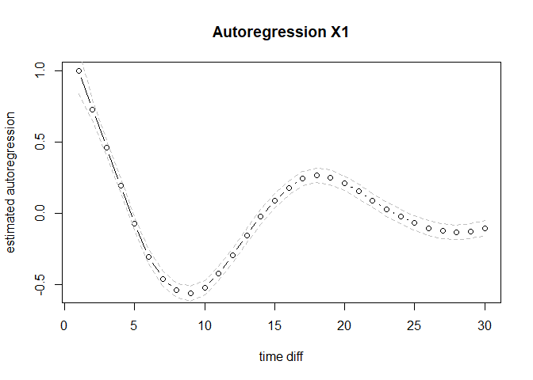
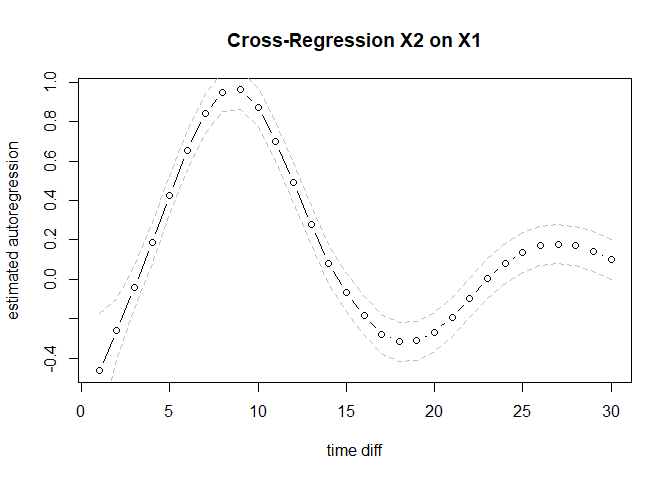

# expct

An `R` package to extract dynamic features from regularly/irregularly
spaced univariate/multivariate time series.

The package takes a longitudinal dataset as the input. Relying on a
simple data-stacking approach and Generalized Additive Mixed Models
(GAMMs), it allows researchers to:

-   1)  Visualize the dynamic relationship between covariates and
        outcomes as a function of time-interval, as shown below.

-   2)  Estimate the functional form of lagged correlations as a
        function of the time-interval between measurements.

-   3)  Build various Confidence Intervals (CIs) to measure the
        estimation uncertainty of lagged correlations.

## Background

This repository contains an `R` package used by ZZZ (in preperation0) to
qqq

## Installation

The current version of this package can be installed directly from
github using

``` r
devtools::install_github("ryanoisin/expct")
```

    ## Skipping install of 'expct' from a github remote, the SHA1 (9bc27833) has not changed since last install.
    ##   Use `force = TRUE` to force installation

## Usage

To deploy this package, a longitudinal dataset is taken as the input.
The raw data is then stacked to serve for estimating GAMMs. Then, the
point estimations of lagged correlations and corresponding CIs can be
built.

More specifically, the main function of this package is `CTVEM`. Some
important input options of this function are:

-   1)  dataset: Specify the longitudinal dataset which contains Time
        (measurements time) , ID and covariates columns.

-   2)  quantiles: The quantiles to build CI, the default value is
        c(low_quantile, high_quantile) = c(.025, 0.975).

-   3)  Tpred: A vector which indicates that interested time points in
        which we want to estimate correlations, e.g. regularly spaced
        seq(0,30,1) and iregularly spaced c(1,5,6,9,15).

-   4)  output_type: Indicate which output format will be returned. If
        output_type == “CI”, point estimations and corresponding CIs
        will be returned. If output_type ==“PE”, only ponit estimation
        will be returned. If output_type ==“SCI”, the Simultaneous CIs,
        which is based on
        [Link](https://fromthebottomoftheheap.net/2016/12/15/simultaneous-interval-revisited/)
        will be returned. If output_type ==“LLCI”, the CIs with
        large-lag errors will be returned. This type of CIs is based on
        the
        [Book](https://books.google.com/books?hl=en&lr=&id=rNt5CgAAQBAJ&oi=fnd&pg=PR7&dq=Time+series+forecasting+and+control&ots=DK80uNo2Wy&sig=qqqwadWjU9h-ZeP9a-lXxpVdb_Q#v=onepage&q=Time%20series%20forecasting%20and%20control&f=false)
        `Time series analysis: forecasting and control`. The default
        value is “CI”.

The output of this functions is a list which contains below elements:

-   1)  est: The point estimation of lagged correlations between
        covariates and outcomes.

-   2)  highCI: The uppper CI of the point estimation.

-   3)  lowCI: The lower CI of the point estimation.

-   4)  laglongreducedummy: The stacked dataset from the raw data.

-   5)  attributes: All attributes used to estimate GAMMs.

### Example

Load data:

``` r
load("data/simdata.rda")
library(expct)
head(simdata)
```

    ##      id      time          Y1         Y2
    ## [1,]  1  0.000000  1.91866673  0.7673046
    ## [2,]  1  3.338756 -0.76230415  0.6131818
    ## [3,]  1  5.878493 -0.58990520  0.4041070
    ## [4,]  1  7.950279  1.72802101 -0.3894506
    ## [5,]  1 10.060890  1.34938143  1.4604215
    ## [6,]  1 14.870422  0.01682572  3.1393569

Perform analyses with `CTVEM`:

``` r
library(mgcv)
```

    ## Warning: package 'mgcv' was built under R version 4.2.2

    ## Loading required package: nlme

    ## This is mgcv 1.8-41. For overview type 'help("mgcv-package")'.

``` r
Tpred = seq(1,30,1)

est <- expct(
  dataset = simdata,
  Time = "time",
  outcome = c("Y1","Y2"),
  ID = "id",
  estimate = "marginal",
  Tpred = Tpred,
  plot_show = F,
  quantiles = c(.025, 0.975),
  method = "bam",
)
```

    ## Perform the 1/4 time marginal expct estimation.
    ## Perform the 2/4 time marginal expct estimation.
    ## Perform the 3/4 time marginal expct estimation.
    ## Perform the 4/4 time marginal expct estimation.

``` r
plot(est$est[[1]], type = "b", ylab = "estimated autoregression", xlab = "time diff", main = "Autoregression X1")
lines(est$highCI[[1]], lty = 2, col = "gray")
lines(est$lowCI[[1]], lty = 2, col = "gray")
```

<!-- -->

``` r
plot(est$est[[2]], type = "b", ylab = "estimated autoregression", xlab = "time diff", main = "Cross-Regression X2 on X1")
lines(est$highCI[[2]], lty = 2, col = "gray")
lines(est$lowCI[[2]], lty = 2, col = "gray")
```

<!-- -->

``` r
# plot(mcr$est[[2]], type = "b", ylab = "estimated autoregression", xlab = "time diff", main = "Cross-Regresion")
# plot(mcr$est[[3]], type = "b", ylab = "estimated autoregression", xlab = "time diff", main = "Autoregression X1")
# plot(mcr$est[[4]], type = "b", ylab = "estimated autoregression", xlab = "time diff", main = "Autoregression X1")
```

## Contact Details

For more details please contact **<o.ryan@uu.nl>**
